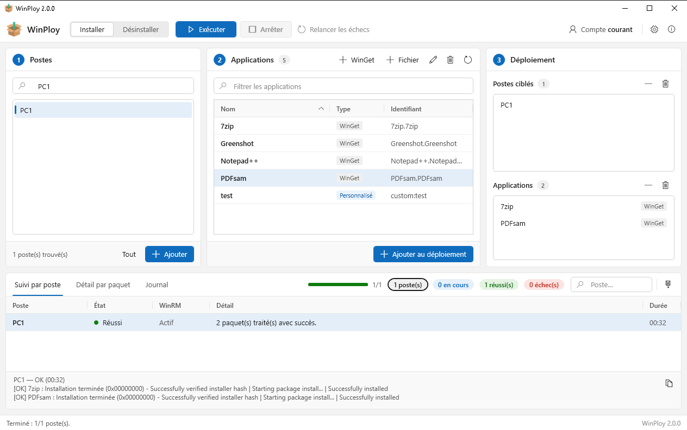

# WinPloy

Déploiement et désinstallation d'applications sur un parc Windows en domaine Active Directory, depuis un
poste d'administration, via WinRM. Application de bureau Windows (C# .NET 8 + WPF).

On choisit des postes, on choisit des applications, on clique sur **Exécuter** : WinPloy ouvre une session
WinRM sur chaque poste, installe ou désinstalle, et affiche l'avancement poste par poste.



*Les trois étapes de gauche à droite — choisir les postes, choisir les applications, lancer — et le suivi
en bas : état par poste, détail par paquet et journal.*

- **Applications WinGet** : installées depuis la source `winget` du poste cible, en SYSTEM.
- **Paquets personnalisés** : un `.msi` ou un script (`ps1`, `bat`, `cmd`, `exe`) posé sur un partage.
  Le dossier du script est copié sur le poste par la session WinRM, exécuté, puis supprimé : le poste
  cible n'a jamais besoin d'accéder au partage.

---

## Fonctions

| | |
|---|---|
| **Postes** | Recherche Active Directory par nom (partiel, joker `*`) dans tout le domaine, sans RSAT |
| **Catalogue** | Fichier JSON partagé entre administrateurs, modifiable depuis l'interface |
| **WinGet** | Recherche en ligne de l'identifiant depuis la fenêtre d'ajout — WinGet n'est pas requis sur le poste d'administration |
| **Personnalisé** | `.msi` lancé par `msiexec /i` (ou `/x`) `/qn /norestart`, ou script exécuté au choix sous le compte de la session WinRM ou en `NT AUTHORITY\SYSTEM` |
| **Exécution** | Panier mixte WinGet + personnalisé, postes traités en parallèle (1 à 50), interface jamais bloquée |
| **Suivi** | État par poste, détail par paquet, journal, filtres, arrêt en cours d'opération, relance des seuls échecs |
| **Traçabilité** | Export CSV des résultats, historique local, journal `gui.log` |

## Prérequis

**Poste d'administration**

- Windows 10 ou 11, membre du domaine.
- Runtime .NET 8 Desktop, ou publication autonome (voir [Compilation](#compilation)).
- Exécution en administrateur : demandée au lancement par le manifeste de l'application.
- Accès en lecture/écriture au catalogue, en lecture aux fichiers des paquets personnalisés.
- Les cibles sont ajoutées à `TrustedHosts` du client WinRM avant chaque opération, et le service WinRM
  local est démarré s'il est arrêté. Une GPO « Hôtes approuvés » peut bloquer cet ajout.
- Facultatif : accès HTTPS à `api.winstall.app` pour la recherche d'identifiants WinGet. Sans cet accès,
  l'identifiant se saisit à la main et la fenêtre propose le lien `https://winget.run/` à copier.

**Postes cibles**

- WinRM activé, port 5985 joignable (GPO recommandée). WinPloy ne configure jamais WinRM ni le pare-feu
  des cibles.
- WinGet (App Installer) présent pour les paquets WinGet.

## Installation

Télécharger l'archive `WinPloy-<version>-win-x64.zip` de la [dernière release](../../releases/latest),
la décompresser où l'on veut, puis lancer `WinPloy.exe` : l'élévation en administrateur est demandée
automatiquement. Le runtime .NET est inclus dans l'archive, il n'y a rien d'autre à installer.

L'exécutable n'étant pas signé, Windows SmartScreen affiche un avertissement au premier lancement :
« Informations complémentaires » puis « Exécuter quand même ».

## Compilation

Pour compiler soi-même, le SDK .NET 8 (ou plus récent) est nécessaire.

```bash
dotnet build WinPloy.sln -c Release
dotnet test WinPloy.sln
```

Publication en un dossier, runtime .NET inclus — rien à installer sur le poste d'administration :

```bash
dotnet publish src/WinPloy/WinPloy.csproj -c Release -r win-x64 --self-contained true -o publish
```

Lancer ensuite `publish\WinPloy.exe`.

## Utilisation

1. **Réglages** (icône engrenage) : au premier lancement, indiquer le chemin UNC du catalogue partagé, par exemple
   `\\serveur\depot\catalogue.json`. Le dossier de ce fichier sert de racine au dépôt des paquets
   personnalisés. Régler au besoin le délai par paquet (1 à 240 min, 30 par défaut) et le nombre de
   postes traités en parallèle (1 à 50, 10 par défaut).
2. **Compte** : par défaut la session WinRM utilise le compte courant. Le bouton « Compte » permet de
   fournir d'autres identifiants d'administration.
3. **Étape 1 — Postes** : chercher les postes dans l'AD, les ajouter à la liste des postes ciblés.
4. **Étape 2 — Applications** : ajouter une application WinGet ou un paquet personnalisé au catalogue,
   puis l'ajouter au déploiement.
5. **Installer / Désinstaller**, puis **Exécuter**. Le suivi s'affiche en bas : état par poste, détail
   par paquet, journal. « Relancer les échecs » rejoue l'opération sur les seuls postes en échec.

### Paquets personnalisés

Chaque paquet doit vivre dans **son propre sous-dossier** du dépôt : le dossier entier est copié sur le
poste cible, donc un script posé à la racine du dépôt y copierait tout le dépôt. WinPloy refuse ce cas.

```
\\serveur\depot\
├── catalogue.json
├── MonApp\
│   ├── setup.msi
│   └── uninstall.ps1
└── AutreApp\
    └── install.ps1
```

Un paquet est considéré réussi si le code de sortie est `0` ou `3010` (redémarrage requis).

### Catalogue partagé

Le catalogue est un simple tableau JSON, modifiable depuis l'interface ou à la main :

```json
[
  { "Type": "WinGet", "Id": "Git.Git", "Name": "Git" },
  {
    "Type": "Custom",
    "Id": "custom:MonApp",
    "Name": "MonApp",
    "InstallScript": "\\\\serveur\\depot\\MonApp\\setup.msi",
    "UninstallScript": "\\\\serveur\\depot\\MonApp\\uninstall.ps1",
    "RunAs": "System"
  }
]
```

Le type est déduit de l'identifiant : le préfixe `custom:` marque un paquet personnalisé.

## Fichiers locaux

Dans `%ProgramData%\WinPloy` :

| Fichier | Contenu |
|---|---|
| `config.json` | Réglages du poste d'administration |
| `historique-deploiements.json` | Historique des résultats |
| `gui.log` | Journal de l'application (rotation à 5 Mo) |

## Structure du dépôt

```
WinPloy.sln
Directory.Build.props          Propriétés communes aux trois projets (TFM, version, nullable)
src/WinPloy.Core/              Bibliothèque : modèles, services, moteur de déploiement WinRM
  Deployment/Remote/RemoteAction.ps1   Script exécuté sur le poste cible, embarqué dans l'assembly
src/WinPloy/                   Application WPF : fenêtres, ViewModel, thème
tests/WinPloy.Tests/           Tests unitaires xUnit, sans réseau ni domaine
assets/                        Icône de l'application, utilisée à la compilation
docs/PLAN-CONVERSION.md        Plan de la conversion PowerShell → C#
docs/images/                   Captures d'écran du README
legacy/Winploy-GUI.ps1         Script PowerShell d'origine (v1.0.0), conservé pour référence
```

## Historique

WinPloy 1.0.0 était un script PowerShell + WinForms unique,
[`legacy/Winploy-GUI.ps1`](legacy/Winploy-GUI.ps1). La version 2.0 est une réécriture complète en
C# .NET 8 + WPF, décrite dans [docs/PLAN-CONVERSION.md](docs/PLAN-CONVERSION.md).

Différences avec la version PowerShell :

- Requêtes LDAP natives au lieu du module ActiveDirectory : plus besoin des RSAT.
- Un poste = une tâche dans le processus, au lieu d'un job PowerShell dans un processus séparé.
- Fenêtre d'identifiants propre à WinPloy au lieu de `Get-Credential`.
- Paquets personnalisés au format `.msi` et recherche en ligne des identifiants WinGet.
- Les nouvelles dates de l'historique sont au format ISO 8601.

Le format du catalogue n'a pas changé : les deux versions peuvent l'utiliser en même temps pendant la
transition.

## Licence

Distribué sous licence [Apache 2.0](LICENSE) — Copyright 2026 Constant Segretain.

---

Auteur : Constant Segretain
